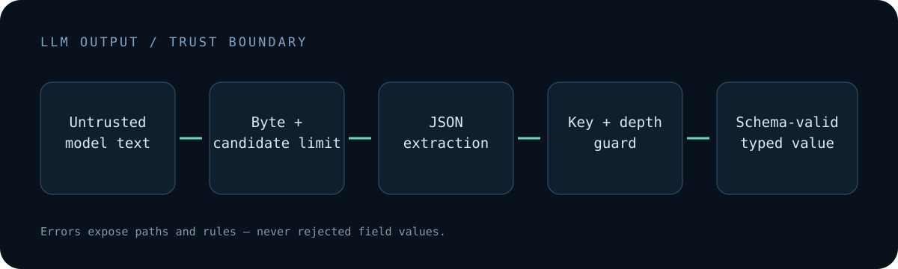

# LLM Output Contract

Provider-independent JSON extraction and schema validation for untrusted LLM output.

Model providers increasingly offer structured-output modes, but real applications still receive fenced JSON, explanatory text, malformed candidates, unexpected fields, oversized responses, and unsafe object keys. LLM Output Contract creates a small trust boundary between model text and application code.



## What it implements

- extracts raw, fenced, or balanced JSON candidates;
- respects quoted braces while scanning mixed text;
- limits input bytes, nesting depth, and candidate count;
- rejects `__proto__`, `prototype`, and `constructor` keys;
- validates parsed data with JSON Schema through Ajv;
- returns bounded errors containing paths and rules, not rejected field values;
- exposes both a TypeScript API and a CLI;
- works independently of OpenAI, Anthropic, Gemini, or local model clients.

## Install and validate locally

Requires Node.js 20 or newer.

```bash
npm install
npm run check
```

Once published to npm, the intended package install is:

```bash
npm install llm-output-contract
```

## TypeScript API

```ts
import { createOutputContract } from "llm-output-contract";

interface Ticket {
  id: string;
  priority: "low" | "high";
}

const ticketContract = createOutputContract<Ticket>({
  type: "object",
  properties: {
    id: { type: "string", minLength: 1 },
    priority: { type: "string", enum: ["low", "high"] }
  },
  required: ["id", "priority"],
  additionalProperties: false
});

const result = ticketContract.parse(modelText);
if (result.ok) {
  queueTicket(result.value);
} else {
  console.error(result.error.code, result.error.details);
}
```

## CLI

Validate a saved response:

```bash
npm run build
node dist/cli.js \
  --schema examples/ticket.schema.json \
  --input examples/ticket-response.txt
```

Or pipe model text through stdin:

```bash
printf '%s' '{"id":"SUP-1","priority":"low","summary":"Example"}' \
  | node dist/cli.js --schema examples/ticket.schema.json
```

Exit codes are `0` for a valid contract, `1` for rejected model output, and `2` for CLI/configuration errors.

## Error boundaries

Validation errors expose the JSON pointer, schema pointer, keyword, and a generic message. They intentionally omit rejected field values so logs do not automatically duplicate customer or secret data.

This package does not execute the output, repair it with another model, or silently coerce values. A rejection remains visible to the calling application.

## Current status and limitations

Version 0.1 is an early open-source library. It validates JSON structure only. It does not sanitize HTML, SQL, shell commands, URLs, clinical content, authorization decisions, or business rules. It does not guarantee that schema-valid data is true, safe, or appropriate for a downstream action.

The balanced extractor is deliberately bounded and is not a general parser for arbitrary programming-language output. Applications should keep schemas narrow and apply domain-specific checks after parsing.

## Security and contributing

See [SECURITY.md](SECURITY.md) for trust boundaries and [CONTRIBUTING.md](CONTRIBUTING.md) for change requirements.

## License

MIT
